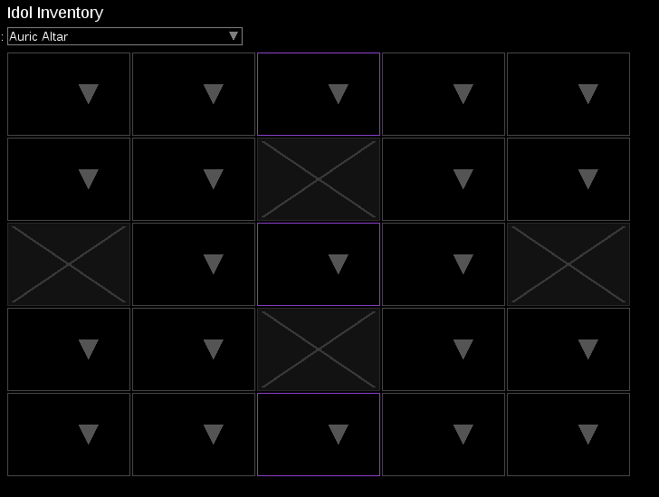
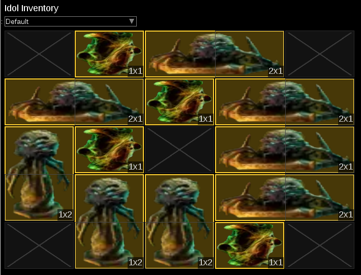
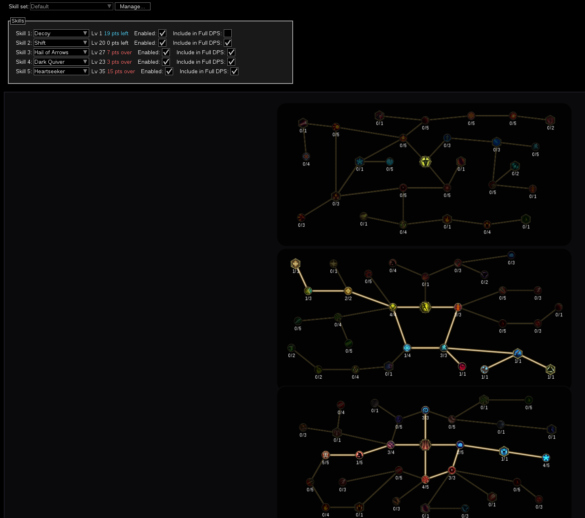

## Dev Log

## 2026-04-04

- **Skills Tab Phase 3 UI** (complete, merged to dev):
  - reqPoints prerequisite gating fully fixed: `PassiveSpec.lua` was reading `node.reqFromParent` (never populated); corrected to `node.reqPointsMap` built by `PassiveTree.lua`
  - Dealloc blocked when removing a point would violate a linked node's reqPoints gate (e.g. cannot reduce Jolting Strikes below 2 while Tempest Weapon is allocated)
  - All 5 skill slots auto-reset when the player changes class (detected via `curClassId` diff in `SkillsTab:Draw`)
  - Dynamic damage type conversion per skill tree: last-wins per `fromType`; `MULTI_CONV_TREES` whitelist for skills like Explosive Trap that allow multiple simultaneous conversions
  - Clicking an empty spec slot now opens the skill selection overview instead of doing nothing
  - Fixed stack overflow in `CalcTriggers.lua`: placeholder cache entry prevents re-entrant recursion through cast-on-hit → buildActiveSkill → initEnv → triggers → cast-on-hit loop
  - Skill name + UNSPENT POINTS info bar drawn at layer 145 (above skill background art at layer 15 and tree nodes at 25); spec slots drawn at layer 150
  - "X UNSPENT POINTS" font size increased to 14; alloc/max point text restored on skill tree nodes

## 2026-04-03

- **New Passive Tree UI** (complete, merged to dev):

## 2026-04-02

- Fixed stat display color codes in `Global.lua` to match LE game colors:
- Added subclass/mastery badges on left side of passive tree (`PassiveTreeView.lua`) at x=-380
- Extended ModParser: attribute conversion mod names (Season 4), "for each of your totems/minions" scope modifiers, "X% chance to gain [BuffName] for N seconds" pattern

## 2026-04-01

- **Defense formulas from tunklab.com**: armor mitigation, block mitigation (rating→DR%), dodge chance (evasion→dodge%), ward decay (v1.1 quadratic), corruption/monolith scaling
- Fixed block calculation (rating not percentage), dodge chance (was always 0%), ward decay formula
- Added CalcSections: Block Effectiveness rating, Block Mitigation %, Elemental Armor DR, Ward Decay Per Second
- **Ailment system**: 28 damaging ailments, 10 non-damaging debuffs, 8 resistance shreds with Chance/Duration/DPS-per-Stack
- Witchfire dual-type DPS (Fire + Necrotic), Warlock Overload (4 types), positive buff Config options, stacking buff Config inputs
- 220+ lines CalcSections display entries, 79 ModParser keywords

## 2026-03-31

- Fixed CalcOffence crash: removed all PoE-specific cost conversion code (Blood Magic, Petrified Blood, ES cost, Rage→Soul, etc.)
- **Idol Altar UI redesign**: auto-detected layout from baseName, renamed Omen Idol slots to "Fractured 1-6", import auto-populates Fractured slots
- **Combat mechanics audit**: fixed stun threshold formula (now includes Ward + StunAvoidance), fixed "stun avoidance" mod mapping (flat stat not % chance)
- Removed all Energy Shield dead code: 14 files, -175/+45 lines
- **Tree UI improvements**: replaced procedural dot rendering with game-accurate sprites (dot-N-M.png), connector lines split around dots, removed Weapon Set swap UI, fixed multi-cell idol tooltip on blocked cells

## 2026-03-30

- **+Skill level system**: global ("+X to All Skills") and per-skill ("+X to [SkillName]") mods now apply. SkillsTab shows teal "+N" suffix. Fixed Cursed Coin Amulet implicit. Fixed 621 broken ModCache entries
- **ModParser improvements**: added channel cost, ward regen, glancing blow, block effectiveness, stun/crit avoidance entries. Fixed "void" substring bug consuming "Stun A**void**ance". Added specialModList patterns. Added CalcSections display for Glancing Blow, Crit Avoidance, Stun Avoidance. Fixed WardRegen→WardPerSecond mapping
- **reqPoints gate system**: nodes requiring minimum parent points now enforced in path-building, visually indicated with dot indicators on connectors. Gated connectors dark brown when unmet. Fixed reqPoints array ordering (JSON reversed). Increased zoom limits
- **Save file format analysis**: decoded item byte array (formatVersion 2), affix encoding, unique/legendary parsing, blessing/lens container mapping. Extended blessing import for containerID 44-45 (empowered monolith extra slots)
- **Buff skill tree nodes fix**: stripped SkillId tags from buff skill tree nodes so mods apply globally when Enabled (affects Enchant Weapon, Holy Aura, Flame Ward, Focus, etc.)
- **Idol/rarity UI**: replaced blocked-cell rendering with game-accurate texture. Implemented LE rarity colors (NORMAL/MAGIC/RARE/UNIQUE/EXALTED/LEGENDARY/SET). Removed 25 PoE color codes. Fixed Exalted rarity detection (0-indexed). Extended affix parsing to 5 slots for sealed affixes
- **Tree data sync**: replaced all 1.4 passive/skill tree data (5 classes). Fixed ~4,200 positions, 89 connections, ~1,567 stat updates, 12 renames. Added 584 missing sprites (0 missing now)
- Fixed idol grid position mapping.

## 2026-03-29

- **Leech parsing**: `+X% [Type] Damage Leeched as Health` now resolves to DamageLifeLeech.
- Added LE rarity color codes, removed PoE legacy entries (GEM, RELIC, PROPHECY)
- Fixed affix ID decoding, RARE item generated names, altar implicits

## 2026-03-28

- Blessing data updated for Season 4
- Verified and fixed skill tree node data for all 127 skills — 160 corrections applied

## 2026-03-26

- Implemented S4 Idol Altar system with dynamic grid layouts

## 2026-03-25

- Implemented Idol Altar layout
  

## 2026-03-24

- Updated database for Season 4
- Updated Pinnacle boss data

## 2026-03-22

- Updated Idol UI from text to PNG icons
  

## 2026-03-19

- Separated passive tree and skill tree: passive → Tree tab, skill trees → Skills tab
  

## 2026-03-05

- Implemented Blessings
  

## before 2026-03-04

- Implemented Affix's mod to ModParser and CalcOffense
